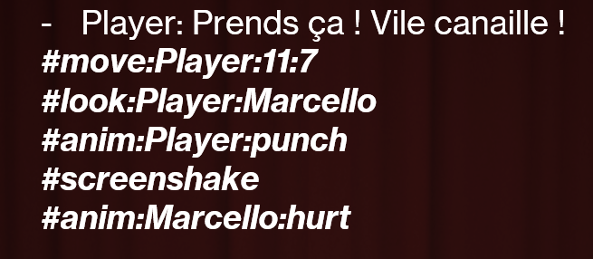

# 🎭 **Pendrillons** 🎭

> Game created in 3 months as an end-of-year project in the first year of the Master's degree at ENJMIN. It was made by 5 people.

**Pendrillons** is a **micro RPG** that takes place in a play. Act out your role, choose your lines and actions, and engage in **turn-based** combat to influence the course of the show. But beware: an audience is **watching** the performance, and **reacting** to your every move!

Game length : around 1H

## Technical Aspect
The project use [Ink](https://www.inklestudios.com/ink/), a tool for narrative design and provides a plugin on Unity. We extends the tag system to allows Narrative Designer to pass more data with **Tags** like moving character, passing animation, add screenshake. You can consult our Tags Documentation [here](https://docs.google.com/spreadsheets/d/159-_DyjS9TTWnV00RtjgZEjndyuSG4_6SIDaAALb5EY/edit?usp=sharing) here.

---
### Example
Dialogue in Ink file:

### Result
What appears on Unity:

---

## Team

| Member  |   |
| ----- | - |
| 🎲 [Maxence Martiniani](https://dotsquare.itch.io/)           | Game Design           |
| 💻 [Théophile Carrasco](https://eyecrown.itch.io/)            | Developer             |
| 🧠 [Lud.e Chatain](https://lud-e.itch.io/)                    | Ergonomic             |
| 🖌️ [Victorien Prévot](https://victorien-prevot.itch.io/)      | Visuals               |
| 🎵 [Romain Belet](https://swiitsh.itch.io/)                   | Sound Design          |